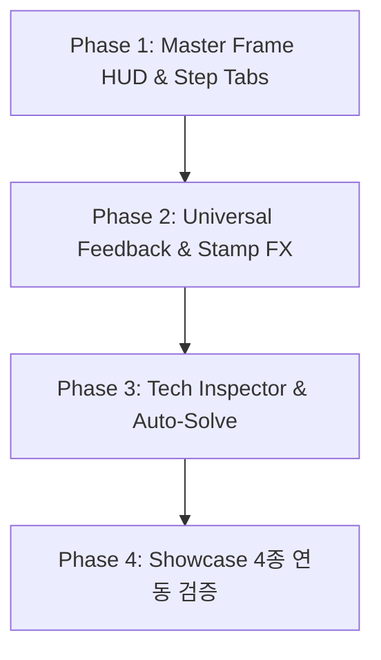

# Master Plan: Master Frame UI/UX & Portfolio Showcase Architecture

## 1. 개요 및 비전 (Goal & Vision)
모든 포팅된 미니게임(Gen 1~3, 72종 챌린지 퍼즐)을 일관되고 세련되게 감싸는 **마스터 프레임 UI(Master Frame HUD)** 및 **포트폴리오 쇼케이스 시스템(Tech Inspector & Auto-Solve)**을 구축합니다.

---

## 2. 세부 구현 단계 (Phases of Implementation)

---

### [Phase 1] 상단 마스터 헤더 & 스텝 탭 네비게이터 (`UniversalStageManager`)
- **위치**: `Assets/MasterFramework/Navigation/UniversalStageManager.cs`, `Assets/Scenes/MasterSandbox.unity`
- **주요 작업**:
  1. **동적 스텝 탭 인디케이터 바**:
     - `LessonOutline.steps` 데이터를 기반으로 상단에 `[Stage 1] -> [Stage 2] -> [Stage 3] -> ...` 탭 버튼을 동적 생성.
     - 현재 진행 중인 탭 하이라이트 및 클릭 시 즉시 해당 스테이지로 점프.
     - 스테이지 클리어 시 탭에 골드 별(★) 점등.
  2. **통합 공용 툴바**:
     - `[← Lobby]`: 로비 씬 복귀.
     - `[🔄 Refresh]`: 현재 스테이지 즉시 리셋.
     - `[📖 Rule]`: 공용 룰 모달 창 열기.
     - `[⚙️ Tech Inspector]`: 개발자 인스펙터 패널 토글.
  3. **공용 룰 모달 팝업 (`UniversalRuleModal.cs`)**:
     - 미니게임 내부의 `pop.png` / 룰 스프라이트를 상단 프레임 레벨에서 깔끔한 글래스모피즘 팝업으로 띄우는 공용 모달 구현.

---

### [Phase 2] 공통 피드백 연출 오버레이 (`UniversalFeedbackOverlay`)
- **위치**: `Assets/MasterFramework/Navigation/UI/`
- **주요 작업**:
  1. **스탬프 & 팡파르 연출 (`IFeedbackStampService` 구체화)**:
     - 스테이지 정답 확인 통과 시 `[Great! / Perfect!]` 도장 펀치 스케일 애니메이션(DOTween) 및 파티클 버스트 재생.
     - 성공 효과음 트리거.
  2. **오답/실패 시 부드러운 쉐이크 (Camera / UI Shake)**:
     - 룰 검증 실패 시 화면 또는 보드 영역에 경쾌한 좌우 흔들림 피드백.

---

### [Phase 3] 엔지니어링 대시보드 & Auto-Solve 아키텍처
- **위치**: `Assets/MasterFramework/Navigation/Inspector/`
- **주요 작업**:
  1. **기술 스택 뱃지 (Tech Badges)**:
     - `PortfolioGameOutline`에 정의된 `techTags`를 읽어 슬라이드 사이드 패널에 뱃지 형태로 시각화 (`Zenject SubContainer`, `UniRx`, `Data-Driven SO`, `A* Pathfinding`, `Constraint Satisfaction` 등).
  2. **실시간 룰 검증 뷰어 (Live Rule State)**:
     - `IRuleValidator`의 현재 유효성 상태를 boolean 텍스트/아이콘으로 실시간 표시.
  3. **원클릭 정답 시연 치트 (`[⚡ Auto Solve]`)**:
     - `LevelData` 스키마에 `solutionPreset` 필드 정의.
     - AI 역산 스크립트로 4종 대표 게임의 정답 족보 데이터 생성 및 SO 바인딩.
     - `[⚡ Auto Solve]` 클릭 시 족보 데이터를 현재 활성 보드에 원클릭 주입 $\to$ 정답 확인 호출 $\to$ 실시간 룰 통과 연출 발동.

---

### [Phase 4] 대표 쇼케이스 4종 검증 및 폴리싱
1. **Month 35 High (시소 논리 퍼즐)**: 4x5~5x5 셀 숫자 족보 주입 Auto Solve 및 시소 균형 검증.
2. **Month 36 High (회로 만들기 퍼즐)**: 4x6~7x7 회로 토글 족보 주입 Auto Solve 및 폐곡선 루프 검증.
3. **Why02 Week 11 (우물고누 AI)**: AI 수읽기(Minimax) 상태 뷰잉 및 스테이지 네비게이션.
4. **Month 10 High (직사각형/정사각형 분할)**: 드래그 프레임 스폰 족보 주입 Auto Solve 및 기하 분할 검증.
