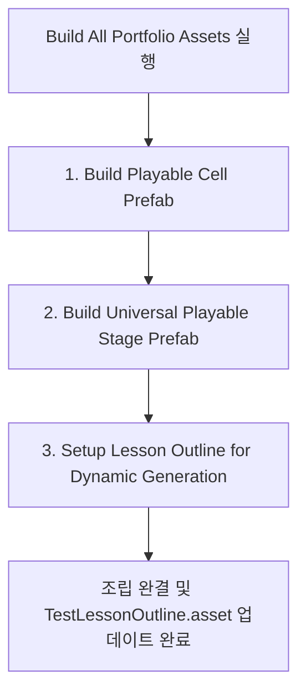

# 종합 리포트: 마스터 프레임워크 확장 및 테마파크 포트폴리오 통합 구축 완료 보고서

이 보고서는 프로젝트에 대한 최초 파악 단계부터 1호 콘텐츠(Month 10 High)의 데이터 기반 동적 생성 이식, 컴파일 오류 및 레이아웃 타이밍 버그 교정, 그리고 로비 시스템 및 공용 조작 잠금 튜토리얼 설계까지 이번 통합 세션 전체에 걸쳐 수행된 모든 아키텍처 개정 및 세부 변경사항을 총망라하여 수립한 공식 설명서입니다.

---

## 1. 프로젝트 목표 및 포팅 아키텍처 개요

### A. 목표 (Goal)
전 회사에서 개발한 실서비스용 크레버스 게임 콘텐츠들을 한자리에서 탐색하고 플레이할 수 있는 **"미니게임 천국" 스타일의 테마파크형 포트폴리오(LobbyHub)**를 구축합니다.
*   **회사 외부 작업물 배제**: Algomain(중단 프로젝트), RocketMan, Project H 등 외부 사이드 프로젝트를 정교하게 걷어내고, 회사 개발작(Gen 1, 2, 3) 중심의 통합 포트폴리오 기반을 마련했습니다.
*   **Gen 2 & 3 우선순위화**: 노후된 Gen 1 콘텐츠의 비중을 낮추고, 검증 알고리즘과 정답 확인 로직이 확실한 Gen 3 및 Gen 2 Challenge 퍼즐 위주로 포팅 로드맵을 선적용했습니다.

### B. 변경된 포팅 패러다임 (Static ➔ Dynamic)
*   **기존 방식 (Legacy Static)**: 각 스테이지별로 씬을 분리하고, 인스펙터 상에 그리드 크기와 기호(가로/세로/사각형)를 수동 배치 및 드래그 앤 드롭으로 묶어둔 밀접 결합(Tight-Coupled) 형태였습니다.
*   **변경된 방식 (Data-Driven Dynamic)**: 게임 씬 하나(`MasterSandbox.unity`)에서 데이터 클래스([PlayableLevelData](file:///c:/dev/Unity/Creverse/CreversePortfolio/CreversePortfolio/Assets/MasterFramework/Core/PlayableLevelData.cs)) SO 에셋만 수신하면, 런타임에 그리드 사이즈, 셀 프리팹, 사양 검증 로직, 힌트 프레임을 자동으로 빌드하는 모범 사례(Best Practice)로 완전히 이전했습니다.

---

## 2. 새로 추가된 핵심 구성요소 및 제작 의도

| 구성 요소 | 제작 이유 (Why) | 설계 시 고려한 점 (Considerations) |
| :--- | :--- | :--- |
| **[PortfolioGameOutline](file:///c:/dev/Unity/Creverse/CreversePortfolio/CreversePortfolio/Assets/MasterFramework/Navigation/PortfolioGameOutline.cs)** | 테마파크 로비에서 각 미니게임의 메타데이터(타이틀, 썸네일, Gen 태그, 사용 기술 스택)를 관리하고 레벨 아웃라인과 연결하기 위함. | 인스펙터를 열지 않고도 사용 기술 태그(예: `Zenject`, `UniRx`)를 스트링 배열로 직관적으로 편집할 수 있도록 SO 자산 형태로 선언. |
| **[PortfolioLobbyManager](file:///c:/dev/Unity/Creverse/CreversePortfolio/CreversePortfolio/Assets/MasterFramework/Navigation/PortfolioLobbyManager.cs)** | 미니게임 목록을 카드 형태로 렌더링하고, 플레이 진입 및 디테일 뷰를 출력하는 LobbyScene 전용 중앙 컨트롤러. | 썸네일 카드 프리팹이 누락되었을 경우에도 화면에 텍스트 버튼 형태로 자동 폴백(Fallback)되어 안전하게 플레이어 세션이 가동되도록 조치. |
| **[UniversalStageManager 확장](file:///c:/dev/Unity/Creverse/CreversePortfolio/CreversePortfolio/Assets/MasterFramework/Navigation/UniversalStageManager.cs)** | 로비에서 선택한 전역 static 게임 정보를 읽어들여 HUD에 바인딩하고, 이탈 시 로컬 PlayerPrefs에 캐시 상태를 영구 동기화한 후 로비로 회귀하기 위함. | `LessonSessionContext`가 Struct(값 타입)로 구현된 것에 대응하여 null 연산 예외(CS0019)가 발생하지 않도록 문법 필터링을 거치고, 로컬 저장 수명주기(`SaveIntermediateStateAsync`) 연동. |
| **[ILockableElement](file:///c:/dev/Unity/Creverse/CreversePortfolio/CreversePortfolio/Assets/MasterFramework/Tutorial/ILockableElement.cs)** | 유저의 마우스 입력(터치/드래그) 인터랙션을 다이나믹하게 차단하여 가이드 라인 밖의 오조작을 제어하기 위함. | 게임 셀(`PlayableRectSquareCell`)과 펜스(`PlayableRectSquareFrame`)에 인터페이스를 상속시켜 `IsLocked` 상태가 켜지면 터치 및 호버 X 버튼 호출이 즉시 바이패스되도록 가공. |
| **[TutorialEngine](file:///c:/dev/Unity/Creverse/CreversePortfolio/CreversePortfolio/Assets/MasterFramework/Tutorial/TutorialEngine.cs)** | float 값을 임의의 Vector3에 인코딩하던 불완전한 레거시 트윈 애니메이션을 제거하고, 데이터 기반 `TutorialSequence` SO에 맞춰 강제 연출을 구동하기 위함. | 외부 플러그인(DOTween) 설치 여부와 상관없이 out-of-the-box 빌드가 가능하도록 UniTask 비동기식 Lerp 이징 트윈 솔루션을 자체 장착. `Camera.WorldToScreenPoint`를 활용해 월드 위치와 Canvas 상의 가이드 말풍선 위치 자동 정렬. |

---

## 3. 에디터 자동화 툴체인 (MasterFramework 메뉴 사용법)

유니티 메뉴 바 상단에 **`MasterFramework`** 전용 도구가 신설되었습니다. 에셋 조립 및 이식 설정을 클릭 한 번으로 완결할 수 있습니다.

### ⚙️ MasterFramework > Build All Portfolio Assets (통합 명령어)
해당 메뉴를 클릭하면 아래 3가지 서브 툴이 자동 순차 실행되어 포팅 조립을 마칩니다:

1.  **Build Playable Cell Prefab**:
    *   `PlayableRectSquareCell` 컴포넌트, `CanvasRenderer`, `Image`를 포함하는 UI 셀 원형을 메모리에 가상 조립합니다.
    *    Month 10 High의 세 가지 고유 기호 스프라이트를 GUID 매핑을 통해 리소스 폴더 연결 없이 불러와 `signSprites` 슬롯에 주입한 후 [PlayableRectSquareCell.prefab](file:///c:/dev/Unity/Creverse/CreversePortfolio/CreversePortfolio/Assets/MasterFramework/Playable/Month10High/AnyResources/PlayableRectSquareCell.prefab) 파일로 자동 저장합니다.
2.  **Build Universal Playable Stage Prefab**:
    *   그리드 판을 자동으로 뿌려줄 셀 부모(`CellParent` 및 `GridLayoutGroup`) 구조와 채점 전용 정답 확인 버튼을 UGUI Tree 형태로 조립합니다.
    *   이 단계에서 `cellPrefab`과 고유 프레임 프리팹 지정을 마친 뒤 [UniversalPlayableStageTemplate.prefab](file:///c:/dev/Unity/Creverse/CreversePortfolio/CreversePortfolio/Assets/MasterFramework/Playable/Month10High/UniversalPlayableStageTemplate.prefab)로 저장합니다.
3.  **Setup Lesson Outline for Dynamic Generation**:
    *   프로젝트 마스터 로더 정보 자산인 [TestLessonOutline.asset](file:///c:/dev/Unity/Creverse/CreversePortfolio/CreversePortfolio/Assets/Scenes/TestLessonOutline.asset)을 엽니다.
    *   기존 수동 씬이 등록되어 있던 Stage 1~4 구역(step 2~5)을 `isDynamicGeneration = true`로 활성화하고, 자동 스폰용 템플릿 프리팹 슬롯에 조립된 프리팹을 주입한 뒤, 추출해두었던 4종의 `PlayableLevelData` SO 에셋 데이터를 다이내믹하게 연결 저장합니다.

---

## 4. 컴파일 오류 및 UGUI 배치 버그 해결 요약

| 이슈 종류 | 발생 현상 | 기술적 분석 및 원인 | 해결 조치 내역 |
| :--- | :--- | :--- | :--- |
| **컴파일 (CS0019)** | `LessonSessionContext` struct null 비교 에러 | `LessonSessionContext`가 Struct 값 타입이므로 null(`!= null`)과 연산자 비교가 불가능함. | `UniversalStageManager`에서 Struct null 비교문을 제거하고 인스펙터 할당 정보로 직접 파이프라인 처리하도록 구조 변경. |
| **컴파일 (CS0535)** | `SetStageData()` 미구현 인터페이스 불만족 | 지난 리팩토링 단계에서 `IStageOrganizer`에 신설된 동적 데이터 주입용 메소드 규약이 레거시 스크립트에 누락됨. | `PlayableMonth10HighStage`, `MockStateStage`, `BaseStageOrganizer` 내부에 다형성 구현 규약 매칭 처리 완료. |
| **레이아웃 (Timing)** | 미리 배치된 고정 힌트(프레임)들이 중앙 `(0, 0)`에 뭉쳐서 렌더링됨 | UGUI의 `GridLayoutGroup` 정렬 연산은 스폰 직후 프레임 말단에 적용되므로, 스폰과 동시에 좌표를 참조하면 정렬 이전 기본 좌표인 `(0, 0)`을 가져옴. | 스폰 직후 `LayoutRebuilder.ForceRebuildLayoutImmediate`를 가동해 셀 배치를 즉시 동기화한 뒤 프레임을 그리도록 보정. |
| **레이아웃 (Scale)** | 격자판 크기가 `100x100`으로 찌그러져 렌더링됨 | 동적으로 생성된 스테이지의 앵커 스트레치 속성이 복사 과정에서 prefab 기본 스케일로 고정되고, 앵커 연산 지연 시차와 겹쳐 셀 크기 연산 오류 발생. | `Instantiate` 직후 루트 UI 패널의 앵커/사이즈를 부모에 핏되도록 스트레치 코드를 추가하고, 배치 확정 시점까지 1프레임 대기(`LastPostLateUpdate`) 주입. |
| **레이아웃 (Tracking)** | 해상도 리사이징 및 가변 상황에서 프레임 정렬 탈조 | 1회성 갱신 플래그(`NeedUpdate = false`) 제어 탓에 창 크기 다이내믹 변경이나 해상도 변경 시 프레임이 셀을 못 따라감. | 프레임 내에 다이나믹 가변 트래킹 연산을 주입해, 참조하고 있는 시작 셀과 끝 셀의 크기/위치가 바뀔 때만 트랜스폼을 자동 재정렬하도록 교정. |
