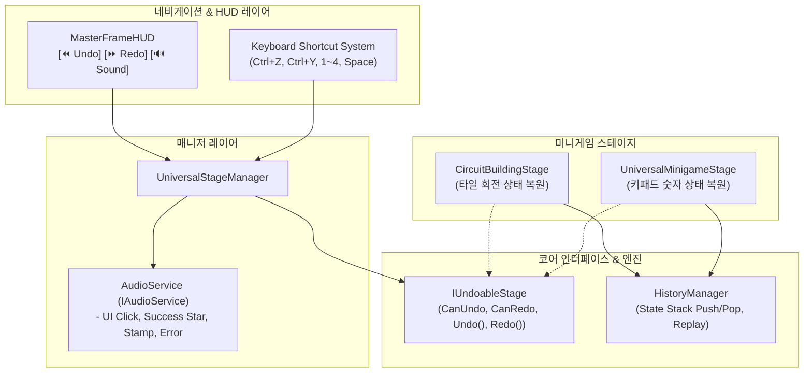

# Master Framework: Undo/Redo History Engine & Audio Architecture Plan

본 문서는 포트폴리오의 구조적 깊이와 실무적 완성도를 대폭 강화하기 위한 **[1] 메멘토 패턴 기반 Undo/Redo & Replay 엔진** 및 **[2] DI 기반 중앙 집중형 오디오 서비스(`IAudioService`)**의 설계 및 구현 방안을 정의합니다.

---

## 1. 아키텍처 설계 개요

---

## 2. 세부 구현 계획

### Component 1: `MasterFramework.Core` - Undo/Redo & Audio Interfaces
1. **`IUndoableStage` [NEW]**:
   * 스테이지가 실행 취소/다시 실행을 지원함을 선언하는 인터페이스.
   * `bool CanUndo { get; }`, `bool CanRedo { get; }`, `void Undo()`, `void Redo()`, `void ResetToInitialState()`.
   * `IObservable<Unit> OnHistoryChanged { get; }` (UI 버튼 활성화/비활성화 반응형 연동).
2. **`HistoryManager<TState>` [NEW]**:
   * 제네릭 메멘토 스냅샷 스택 관리자.
   * `RecordState(TState)`, `Undo(TState current) -> TState`, `Redo(TState current) -> TState`, `Clear()`.
   * `GetAllStates() -> List<TState>` (향후 리플레이 재생용).
3. **`IAudioService` & `AudioService` [NEW]**:
   * Zenject 싱글톤 서비스로 등록 가능한 경량 오디오 매니저.
   * 코드 기반 프로시저럴 사운드 합성(WebAudio/Unity AudioSource 기반: Click, TabSwitch, ClearDing, StampThud, ErrorBuzz).
   * 외부 오디오 파일 없이도 빌드 즉시 동작하는 100% 자립형 무결성 오디오 엔진.

### Component 2: `MasterFramework.Navigation` - HUD & Shortcuts Integration
1. **[MasterFrameHUD.cs](file:///c:/dev/Portfolio/Assets/MasterFramework/Navigation/MasterFrameHUD.cs) [MODIFY]**:
   * 상단 우측 툴바에 `[ ⏪ ]` (Undo), `[ ⏩ ]` (Redo), `[ 🔊 / 🔇 ]` (사운드 토글) 버튼 배치.
   * `IUndoableStage.OnHistoryChanged`를 구독하여 버튼의 상호작용 가능 여부(`interactable`)를 실시간 갱신.
2. **[UniversalStageManager.cs](file:///c:/dev/Portfolio/Assets/MasterFramework/Navigation/UniversalStageManager.cs) [MODIFY]**:
   * 키보드 단축키 감지:
     * `Ctrl + Z` ➡️ `currentStage.Undo()` + `AudioService.Play(SfxType.Undo)`
     * `Ctrl + Y` ➡️ `currentStage.Redo()` + `AudioService.Play(SfxType.Redo)`
     * `M` ➡️ 오디오 Mute 토글
   * 스테이지 로드 및 클리어 시 자동 오디오 효과음 트리거.

### Component 3: `MasterFramework.Playable` - Stage Adaptations
1. **[CircuitBuildingStage.cs](file:///c:/dev/Portfolio/Assets/MasterFramework/Playable/Month36High/Scripts/CircuitBuildingStage.cs) [MODIFY]**:
   * `IUndoableStage` 구현.
   * 스냅샷 데이터 구조: `struct CircuitBoardState { int[] tileRotations; }`
   * 타일 클릭/회전 시 `RecordState()` 호출.
   * `Undo()` / `Redo()` 호출 시 해당 각도로 타일 일괄 복원 및 회로 검증 재실행.
2. **[UniversalMinigameStage.cs](file:///c:/dev/Portfolio/Assets/MasterFramework/Playable/Common/UniversalMinigameStage.cs) [MODIFY]**:
   * `IUndoableStage` 구현.
   * 스냅샷 데이터 구조: `struct SeesawInputState { (int row, int col, string value)[] cellValues; }`
   * 키패드 입력 시 상태 기록 및 복원.
